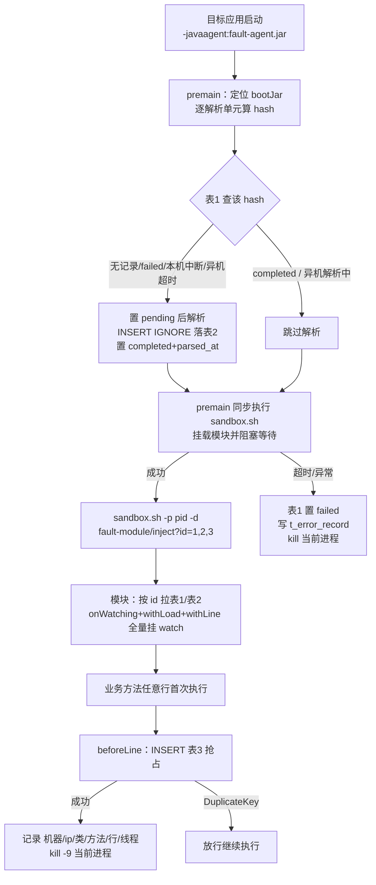

# JVM-Sandbox 故障注入工具（fault-sandbox）实施方案

## 一、目标

目标 Spring Boot 应用（bootJar）以 `-javaagent:fault-agent.jar` 启动时，自动完成「解析用户类与方法 → 落 MySQL → 自动挂载 sandbox 模块」；模块对所有用户类所有方法挂行级 watch，行执行前抢占数据库写故障记录并 `kill -9` 当前进程。硬保护原则：**目标进程要么处于 watch 保护之下，要么不存在**。

交付两个 fat jar（Windows 侧编码构建，Linux 侧运行验证）：

| 产物 | 角色 | 关键内容 |
| --- | --- | --- |
| `fault-agent.jar` | premain agent | 定位 bootJar → 算 hash → 状态机去重 → ASM 解析落库 → 同步触发 sandbox 挂载 → 超时/异常硬保护 |
| `fault-module.jar` | sandbox 模块 | `inject` 命令从 DB 拉方法 → 全量挂 withLine watch → beforeLine DB 抢占 → kill |




## 二、fault-agent：premain 流程

1. **读配置**：`agent.enabled=false` 直接返回放行（唯一放行例外）。
2. **定位 bootJar**：遍历 `RuntimeMXBean.getInputArguments()` 取 `-jar` 后参数（相对路径按 user.dir 归一为绝对路径）；找不到时回退 agentArgs（`-javaagent:fault-agent.jar=bootJar=/path/app.jar`），再回退 config.properties 的 `bootJar.path`。
3. **划分解析单元并算 hash**：

- `BOOT-INF/classes/` 整体为一个单元，hash = 目录下全部 .class 条目按路径排序后内容聚合 SHA-256；
- `BOOT-INF/lib/` 中命中白名单的每个 jar 各一个单元，hash = jar 字节流 SHA-256。

4. **表1 状态机去重**（决定是否解析）：

| 查库结果 | 判定 | 动作 |
| --- | --- | --- |
| 无记录（INSERT pending 占位成功） | 首次解析 | 解析 |
| `completed` | 已解析 | 跳过 |
| `failed` | 上次解析异常 | 条件 UPDATE 置回 `pending`（`WHERE status IN ('failed','pending')` 防并发）+ 刷新 hostname/ip 为本节点 → 解析 |
| `pending` 且 ip=自己 且 boot_jar 相同 | 本机上次解析中断 | 立即抢占重解析（不等超时） |
| `pending` 且 ip≠自己、未超时 | 其他节点解析中 | 等待跳过 |
| `pending` 且 ip≠自己、超时 | 异机孤儿 | 抢占重解析 |


5. **解析**：ZipFile 遍历 + ASM ClassReader；记录每个类的所有方法（方法名+描述符）；排除 `<clinit>` 与 synthetic；无需解析行数。
6. **落库**：表2 批量 `INSERT IGNORE`（业务唯一索引幂等，重解析自动增量补齐，无需清理旧结果）→ 表1 置 `completed` + `parsed_at` + 类/方法计数。
7. **同步挂载**：premain 内同步执行 `sandbox.sh -p <pid> -d "fault-module/inject?id=<表1主键id列表>"`（pid 从 `ManagementFactory` 解析，兼容 Java 8），阻塞等待完成；成功才放行应用启动。同步阻塞的意义：主线程卡在 premain 期间不存在任何用户代码执行，挂载必然先于一切业务代码（含 `@PostConstruct`/`CommandLineRunner`），配合 `withLoad()` 覆盖后续加载的类。
8. **失败语义（硬保护）**：`premain.timeout.ms`（默认 600000=10 分钟，可配）为解析+落库+挂载全程总预算；任一阶段超预算或抛异常 → 表1 置 `failed`、写表4（DB 不可用则退化为本地日志）→ **kill 当前进程**。

## 三、fault-module：sandbox 模块流程

1. `@Command("inject")` 收 `id` 参数（表1 主键列表，逗号分隔）→ 按 id 查表1/表2，类分组、方法名去重。
2. 单个 `EventWatchBuilder` 链式注册全部类/方法：`onClass(...).onBehavior(...).onWatching().withLoad().withLine().onWatch(listener)`——`withLoad()` 保证未加载类加载时也被增强。
3. `beforeLine`：**直接 INSERT 表3 抢占**（唯一索引并发控制，跨机器多节点安全）：

- 插入成功 = 本节点赢得该行故障执行权 → 记录机器名/ip/线程名 → `kill -9` 当前进程（Linux `kill` 命令）；
- DuplicateKey = 该行已被集群内其他节点触发 → 放行继续执行。

4. 进程内 AtomicBoolean 仅作减少同进程多线程重复撞库的优化，正确性完全由数据库唯一约束保证。
5. 语义：多节点并行下**每一行最多导致集群内一个节点死亡**；进程重启后跑到尚未触发过的行仍会继续抢占。

## 四、数据库设计（MySQL 库 `fault_sandbox`，4 张表）

```sql
CREATE DATABASE IF NOT EXISTS fault_sandbox DEFAULT CHARSET utf8mb4;

-- 表1：解析单元记录（去重入口 + 状态机）
CREATE TABLE t_jar_record (
  id            BIGINT AUTO_INCREMENT PRIMARY KEY,
  unit_type     VARCHAR(16)  NOT NULL COMMENT 'CLASSES | LIB_JAR',
  sha256        CHAR(64)     NOT NULL COMMENT '单元内容摘要',
  source_jar    VARCHAR(512) NOT NULL COMMENT '来源 jar 文件名',
  boot_jar      VARCHAR(512) NOT NULL COMMENT '所属 bootJar 完整绝对路径',
  hostname      VARCHAR(128) NOT NULL COMMENT '机器名（当前解析节点）',
  ip            VARCHAR(64)  NOT NULL COMMENT 'IP（当前解析节点）',
  class_count   INT          NULL,
  method_count  INT          NULL,
  status        VARCHAR(16)  NOT NULL DEFAULT 'pending' COMMENT 'pending/completed/failed',
  parsed_at     DATETIME     NULL COMMENT '解析完成时间（pending 为 NULL）',
  updated_at    DATETIME     NOT NULL DEFAULT CURRENT_TIMESTAMP ON UPDATE CURRENT_TIMESTAMP COMMENT '孤儿 pending 判定依据',
  UNIQUE KEY uk_sha256 (sha256)
);

-- 表2：类-方法解析结果（幂等增量插入）
CREATE TABLE t_class_method (
  id           BIGINT AUTO_INCREMENT PRIMARY KEY,
  unit_id      BIGINT       NOT NULL COMMENT '→ t_jar_record.id',
  class_name   VARCHAR(256) NOT NULL COMMENT '完全限定名',
  method_name  VARCHAR(128) NOT NULL,
  method_desc  VARCHAR(256) NOT NULL COMMENT 'ASM 描述符，区分重载',
  UNIQUE KEY uk_method (unit_id, class_name, method_name, method_desc)
);

-- 表3：故障注入记录（集群级抢占）
CREATE TABLE t_fault_record (
  id           BIGINT AUTO_INCREMENT PRIMARY KEY,
  unit_id      BIGINT      NOT NULL COMMENT '→ t_jar_record.id',
  hostname     VARCHAR(128) NOT NULL COMMENT '死亡节点机器名',
  ip           VARCHAR(64)  NOT NULL,
  class_name   VARCHAR(256) NOT NULL,
  method_name  VARCHAR(128) NOT NULL,
  line_no      INT         NOT NULL,
  thread_name  VARCHAR(128) NOT NULL,
  fault_type   VARCHAR(32) NOT NULL DEFAULT 'KILL_PROCESS',
  occurred_at  DATETIME    NOT NULL,
  UNIQUE KEY uk_hit (unit_id, class_name, method_name, line_no)
);

-- 表4：agent 自身错误记录（写入后进程将被 kill）
CREATE TABLE t_error_record (
  id          BIGINT AUTO_INCREMENT PRIMARY KEY,
  phase       VARCHAR(16)  NOT NULL COMMENT 'PARSE | DB | MOUNT',
  error_type  VARCHAR(16)  NOT NULL COMMENT 'TIMEOUT | EXCEPTION',
  message     VARCHAR(1024) NOT NULL,
  detail      TEXT         NULL COMMENT '异常堆栈',
  unit_ids    VARCHAR(256) NULL COMMENT '涉及的表1 id 列表文本',
  boot_jar    VARCHAR(512) NULL,
  hostname    VARCHAR(128) NOT NULL,
  ip          VARCHAR(64)  NOT NULL,
  created_at  DATETIME     NOT NULL DEFAULT CURRENT_TIMESTAMP
);
```

## 五、工程结构

```
c:\Users\86132\Desktop\sandbox行故障\
├── settings.gradle                # include common、fault-agent、fault-module、test-app
├── build.gradle                   # 公共配置：Java 8 基线、mavenCentral、shadow 插件（参照 demo）
├── common/                        # 共享库（agent 与 module 依赖）
│   └── src/main/java/cn/chinaclear/fault/common/
│       ├── FaultConfig.java       # 配置加载（见"配置项"）
│       ├── SchemaInitializer.java # 建库 + 4 张表幂等 DDL
│       ├── JdbcHelper.java        # DriverManager 封装：查询 / 批量 / INSERT IGNORE / 事务
│       ├── JarHashUtil.java       # jar 字节流 / class 条目聚合 SHA-256
│       ├── BootJarParser.java     # ASM 解析：classes 全量 + lib 白名单 jar
│       ├── MachineInfo.java       # hostname + ip
│       ├── KillUtil.java          # kill -9 当前进程（pid 由调用方传入）
│       ├── model/                 # JarRecord / ClassMethodInfo / FaultRecord / ErrorRecord
│       └── dao/                   # JarRecordDao / ClassMethodDao / FaultRecordDao / ErrorRecordDao
├── fault-agent/                   # premain agent（不依赖 sandbox-api）
│   ├── build.gradle               # shadowJar + MANIFEST: Premain-Class
│   ├── src/main/resources/config.properties
│   └── src/main/java/cn/chinaclear/fault/agent/
│       ├── FaultAgent.java        # premain 入口：编排全流程，异常隔离
│       ├── BootJarLocator.java    # -jar 参数 → agentArgs → 配置 兜底链
│       ├── ParseOrchestrator.java # 解析单元划分 + 状态机 + 落库编排
│       └── SandboxMountInvoker.java # 同步执行 sandbox.sh 并阻塞；超时/异常走硬保护
├── fault-module/                  # sandbox 模块（sandbox-api 为 compileOnly 不打入）
│   ├── build.gradle               # shadowJar：mysql/common 打入，sandbox-api 排除
│   ├── src/main/resources/config.properties   # 模块侧 DB 连接配置
│   └── src/main/java/cn/chinaclear/fault/module/
│       ├── FaultKillModule.java   # @MetaInfServices(Module.class) @Information(id="fault-module")；@Command("inject")
│       └── KillAdviceListener.java # beforeLine：INSERT 表3 抢占 → 成功 kill / 冲突放行
├── test-app/                      # 自研 Spring Boot 验证应用（见"验证计划"）
├── scripts/
│   ├── deploy-to-linux.ps1        # scp 产物到 lys2@192.168.193.131
│   └── start-target.sh            # Linux 侧目标应用启动样例（-javaagent 参数）
├── tests/TEST_CASES.md            # 测试用例总入口（用例/日志/数据库三类预期）
└── README.md                      # 配置项 / 表结构 / 使用说明
```

## 六、技术栈与构建

- **Java 8 语法基线**（`RuntimeMXBean` 取 pid 兼容 Java 8），ASM 9.x
- **Gradle 多模块 + shadowJar**（插件 `com.gradleup.shadow`，配置参照用户 demo `C:\Users\86132\Desktop\sandboxTest\build.gradle`；mavenCentral）
- 依赖：common = ASM + mysql-connector-j + slf4j/logback + lombok；fault-agent = common；fault-module = common + `com.alibaba.jvm.sandbox:sandbox-api:1.4.0` + `sandbox-common-api:1.4.0` + metainf-services（sandbox-api/common-api **compileOnly**，随 sandbox 宿主提供）；test-app = spring-boot-gradle-plugin 打 bootJar
- **Windows 仅编码/构建/打包**；运行与验证全部在 Linux
- MySQL 连接串：`jdbc:mysql://<host>:3306/fault_sandbox?useUnicode=true&characterEncoding=utf8&useSSL=false&serverTimezone=Asia/Shanghai&allowPublicKeyRetrieval=true`（host/账号全部配置化）

## 七、配置项（两个模块各自内置 config.properties）

配置文件随各自 shadowJar 打包（`config.properties` 在 jar 根，classpath 读取）。**fault-agent** 额外支持 agentArgs 键值覆盖 jar 内配置（`-javaagent:fault-agent.jar=premain.timeout.ms=300000`）。**fault-module** 读自己 jar 内的配置连库（读表1/表2、写表3/表4）；`inject` 命令参数仅传业务参数（id 列表），不传配置。

**fault-agent 的 config.properties：**

| 键 | 默认值 | 说明 |
| --- | --- | --- |
| `agent.enabled` | `true` | 唯一放行开关：false 时跳过全流程正常启动 |
| `jdbc.url` | `jdbc:mysql://127.0.0.1:3306/fault_sandbox?useUnicode=true&characterEncoding=utf8&useSSL=false&serverTimezone=Asia/Shanghai&allowPublicKeyRetrieval=true` | 故障库连接（部署时改 host） |
| `jdbc.username` | `root` |  |
| `jdbc.password` | `root123` |  |
| `lib.whitelist` | 空 | **第三方 lib 白名单**：BOOT-INF/lib 中需解析的 jar 文件名，逗号分隔，支持前缀匹配 |
| `sandbox.sh.path` | `/home/lys2/sandbox/bin/sandbox.sh` | 挂载命令路径 |
| `premain.timeout.ms` | `600000` | premain 全程总预算（解析+落库+挂载） |
| `bootJar.path` | 空 | 非 `-jar` 方式启动时的 bootJar 兜底路径 |


**fault-module 的 config.properties：**

| 键 | 默认值 | 说明 |
| --- | --- | --- |
| `jdbc.url` | 同上 | 模块侧连库 |
| `jdbc.username` | `root` |  |
| `jdbc.password` | `root123` |  |


## 八、验证计划（全部在 Linux 192.168.193.131 实测）

**前置探测**：Linux JDK 版本、MySQL 可用性（无则便携部署）、`/home/lys2/sandbox` 目录结构（bin/sandbox.sh、sandbox-modules/）。

**验证应用 test-app**：真实 Spring Boot 工程——主类 + Controller（REST）+ Service（方法间调用、每方法 10+ 行）+ `CommandLineRunner`/`@PostConstruct` 启动期逻辑；`spring-boot-gradle-plugin` 打 bootJar；另自制一个业务 lib jar 放入白名单验证 LIB_JAR 单元。

**用例清单**（详细预期记入 `tests/TEST_CASES.md`）：

| # | 用例 | 关键预期 |
| --- | --- | --- |
| TC1 | 首次启动解析落库 | 表1 status=completed、parsed_at 有值；类/方法数与源码一致；白名单 lib 类出现在表2 |
| TC2 | 二次启动跳过解析 | 表1 无新行；启动耗时明显缩短 |
| TC3 | 故障注入命中 | 业务方法行执行 → 表3 新增一条（机器/ip/类/方法/行/线程）→ 进程被 kill -9 |
| TC4 | 重启后续抢 | 重启后同一行 DuplicateKey 放行，跑到新行再 kill |
| TC5 | 多节点并发 | 两实例同时启动：表1 无重复 completed 行（状态机去重）；同一行只死一个节点 |
| TC6 | 本机中断续传 | 手工置某单元 pending(ip=自己, updated_at 很旧) → 启动 → 立即重解析至 completed |
| TC7 | 挂载失败硬保护 | `sandbox.sh.path` 指向不存在文件 → 表1 failed + 表4 TIMEOUT 记录 + 进程被 kill |
| TC8 | agent.enabled=false | 正常启动，无任何解析/挂载动作 |


## 九、部署与使用

1. Windows 构建：`gradle :fault-agent:shadowJar :fault-module:shadowJar :test-app:bootJar`
2. `scripts/deploy-to-linux.ps1` scp 产物：module jar → `/home/lys2/sandbox/sandbox-modules/`；agent jar 与 test-app bootJar → 目标机任意目录
3. Linux 启动目标应用：`java -javaagent:fault-agent.jar -jar test-app.jar`（premain 自动解析落库并同步挂载模块，成功后应用才开始启动）
4. 手动挂载（可选调试）：`./sandbox.sh -p <pid> -d "fault-module/inject?id=1,2,3"`
5. 日志：agent 与模块各自写本地日志文件（premain 阶段日志体系未就绪前的观测兜底）

## 十、工作流约定

- 新工程 `git init`；**每完成一个功能点 commit 一次**（中文信息，write_to_file 写 UTF-8 提交信息文件后 `git commit -F`）
- 全部代码完成后走 **code-review-skill** 评审（重点：premain 异常隔离、JDBC 资源关闭、并发抢占正确性），再用 **code-simplifier** 简化